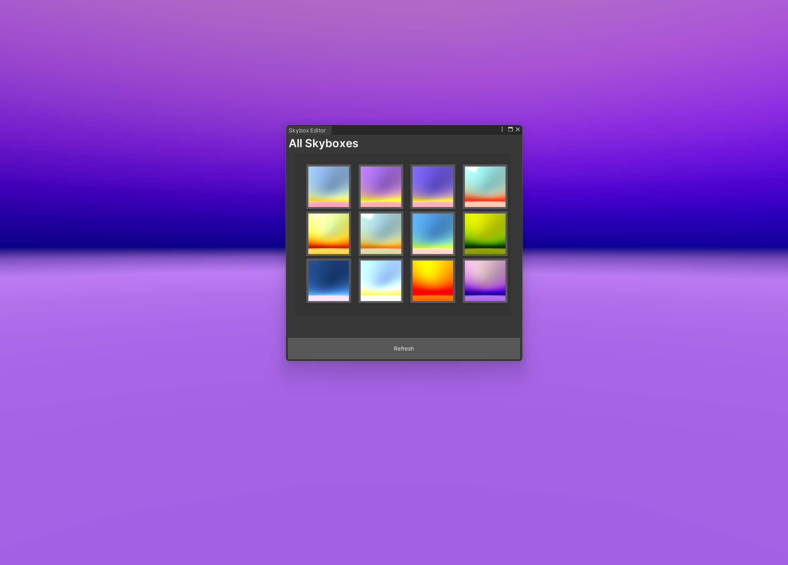
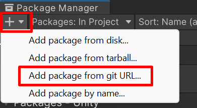
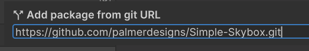
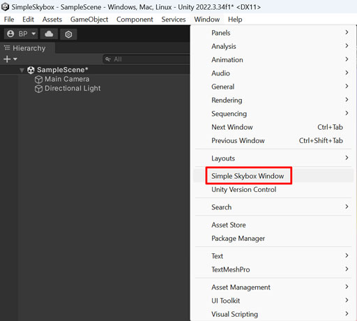
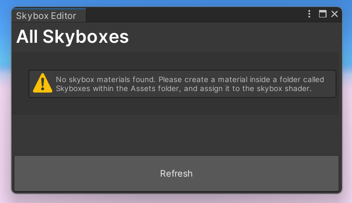
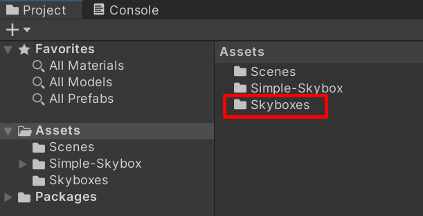
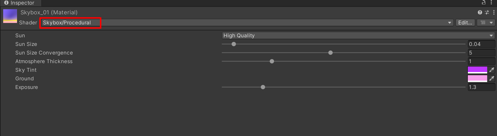
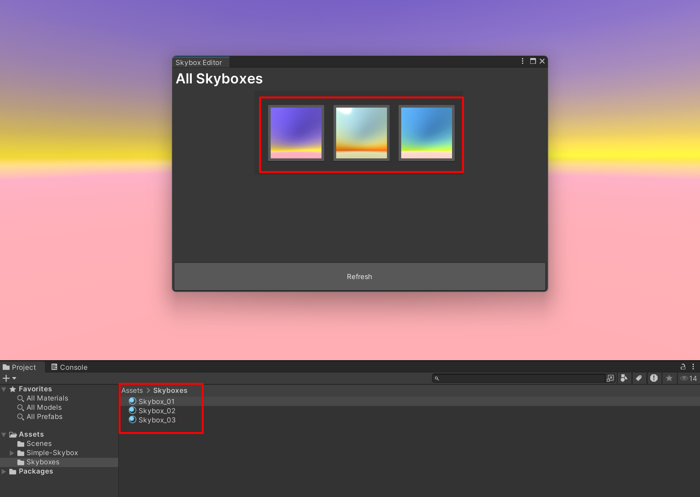

# Simple-Skybox

Welcome to the Simple Skybox Editor for Unity. This tool is engineered to streamline your workflow, enabling quick and efficient skybox swaps within your scene—ideal for rapid prototyping and visual development.

## Install Package
> **Note:** Supports Unity 2019 +

To populate the editor with your custom skyboxes, please proceed as follows:

1. Download or clone this repo. https://github.com/palmerdesigns/Simple-Skybox.git
2. Install Unity https://unity.com/download 
3. Open Unity and navigate to the package manager (Window > Package Manager) and select "Add Package from git URL"

4. Paste "https://github.com/palmerdesigns/Simple-Skybox.git" into the search field
  

  
## Skybox Setup

Open the "Simple Skybox tool" from Window > Simple Skybox Window

and you will see an empty Skybox tool asking to create some skyboxes.

To add skyboxes, create a **"Skyboxes folder"** inside **Assets** and create materials using a **skybox shader** 

> **Note:** for more info about skybox shaders please visit: https://docs.unity3d.com/Manual/skyboxes.html

 After setting up your skyboxes, press the refresh button in the editor. Your skyboxes should now be displayed and ready for use.

### Additional Notes:
1. Supports Unity Version 2019 or higher
2. Free to use in any project!